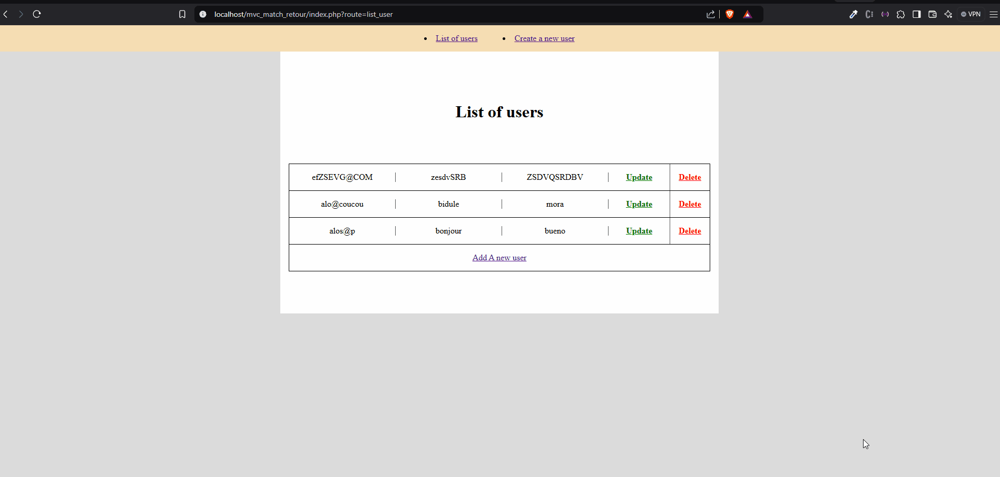

Les contenus du cours [BRE03 Web Dev Course](https://kornog-dev.github.io/BRE03/) © 2024 par [Mari Doucet](https://github.com/kornog-dev) sont sous licence [CC BY-NC-SA 4.0](https://creativecommons.org/licenses/by-nc-sa/4.0/?ref=chooser-v1)

# Execice CRUD en MVC

## But

Même s'il est possible de faire un programme en php ou tout est dans un seul fichier ou en pensant de zero une architecture, il existe des méthodes testées et eprouvée pour la mise en place d'un projet. Leurs but est de mettre en place un programe dans lequel il sera facile d'ajouter des features et de travailler en équipe, sans avoir à repenser tout le code. Le MVC en est une.

Le MVC est une architecture de conception de logiciele qui permet de diviser le travail en trois parties distinctes: le modèle, la vue et le contrôleur.

Le but de ce projet est de mettre en pratique les connaissances acquises en cours et de mettre en place un CRUD en MVC.
En plus du README qui presente brievement le projet et ses composants, je vais essayer d'ajouter des commentaires dans presque tous les fichiers dans le but d'expliquer en detail le fonctionnement du programme.

## Pour comprendre

Pour comprendre un programme et y mettre du sens il faut identifier son point d'entré et suivre l'arborescence de logique qui en découle.
Ici cela commence par l'**index.php** Allez-y et suivez les commentaires ^^

## arborescence du projet et breve description de chaque dossier/fichier

Le projet est structure comme suit :

- **assets**

  - **styles**
    - **css**
    - **scss**
  - **js**

- **config**

  - **Router.php** // Le routeur est l'aiguillage du programme : en fonction de l'url qu'il recoit il invoque la bonne methode du bon controller.
  - **autoload.php** // tous les requires, centralisés dans ce fichier. plus de problèmes de chemins.

- **controllers** //Contient les controllers, nous n'aurons qu'un controller pour cet exercice.

  - **UserController.php** //Ici, UserController a une methode par action possible impliquant les utilisateurs. pour ce faire il commande les managers, renvoi le bon template et tout ce dont le template a besoin au client.

- **managers** //Contient les managers, nous n'aurons besoin que d'un manager pour cet exercice.

  - **AbstractManager.php** //Classe abstraite-> implemente la methode de connexion a la bdd pour tous ses 'enfants'. N'est jamais utilisée telle quelle.
  - **UserManager.php** //Seul enfant de AbstractManager, son seul role doit etre d'interoger la bdd Uniquement pour tout ce qui concerne la table User.

- **models**
  //Une classe qui represente fidelement une table de la bdd: chacun de ses attributs represente une colonne de la table

  - **User.php**

- **templates** //Contient les templates, les vues, et le layout

  - **layout.phtml** //layout
  - **users** //Vues
    - **list.phtml**
    - **show.phtml**
    - **create.phtml**
    - **update.phtml**

- **index.php** //Point d'entree du programme il execute l'autoload, recuppere l'url et la donne au routeur qui decidera de ce qu'on fait .

## Pour tester le programme

Pour tester le programme il vous faudra un serveur php avec une bdd mysql dans laquelle vous pourrez importer la table users située dans la racine du projet.
Vous pouvez utiliser Xampp, Wamp ou autre.

## Le rendu du projet en super GIF

